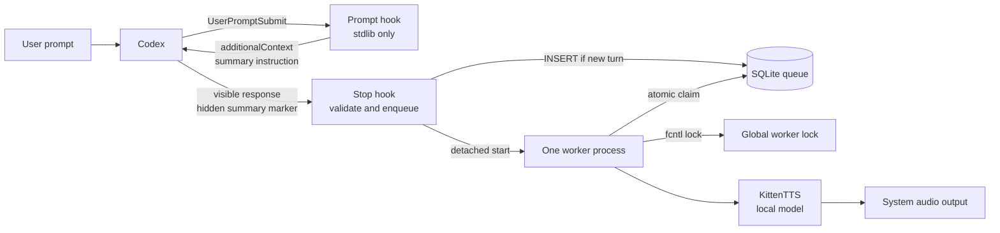

<div align="center">
  <table>
    <tr>
      <td align="center" bgcolor="#202124">
        
      </td>
    </tr>
  </table>
</div>

<h1 align="center">TurnEcho</h1>

<p align="center">
  <strong>Hear the result of every Codex turn.</strong><br>
  A local Codex plugin that speaks a short, useful summary while keeping the
  full response on screen.
</p>

<p align="center">
  <a href="https://github.com/rmscoal/turnecho/blob/v0.1.0/LICENSE">MIT</a>
  · Python 3.13+
  · macOS and Linux
  · Codex plugin
</p>

TurnEcho adds a lightweight audio layer to Codex. It asks the agent for one
short spoken summary, validates that summary at the end of the turn, and
plays it locally in the background. You can keep coding, reviewing, or step
away from the screen while still hearing what changed.

The original Codex response is never replaced or read in full. TurnEcho only
speaks a valid summary marker appended to `last_assistant_message`.

## Why TurnEcho

Long agent turns contain useful detail, but not every moment needs another
screen-sized response. TurnEcho separates the detailed written answer from a
small spoken signal:

- **Stay in the flow.** Hear the outcome, blocker, or next action without
  opening the transcript immediately.
- **Keep the full answer.** Codex still returns its normal response. TurnEcho
  does not rewrite, truncate, or inject audio into the agent response.
- **Use a local audio path.** Summary validation, queueing, text-to-speech,
  and playback happen on the local machine after installation.
- **Handle concurrent work safely.** Multiple Codex sessions share one SQLite
  queue and one process lock, so summaries play sequentially instead of
  talking over each other.

## Features

- **Summary-only speech:** speaks 1 to 3 short conversational sentences,
  limited to the validated TurnEcho summary.
- **Fast hooks:** both Codex hooks use the Python standard library and return
  immediately. TTS model loading and playback stay out of the hook process.
- **Persistent queue:** SQLite stores pending, processing, successful, and
  failed jobs so audio work can continue after the hook exits.
- **Atomic claims:** database transactions ensure that only one worker owns a
  queued job at a time.
- **Cross-session serialization:** an `fcntl` lock allows one worker to own
  audio playback across Codex sessions.
- **Duplicate protection:** repeated hook events for the same
  `(host, session_id, turn_id)` are ignored.
- **Crash recovery:** abandoned `processing` jobs return to `pending` when a
  new worker takes the lock.
- **Lazy model loading:** KittenTTS loads only when pending work exists.
- **Quiet failure behavior:** invalid summaries, hook errors, and queue errors
  preserve Codex's response. Worker failures are recorded in the worker log
  and database without producing audio.

## The extra LLM output

TurnEcho uses a deliberate two-channel response. The visible response remains
the normal answer for the user. The model also appends a hidden HTML comment
that contains a compact, spoken version of the result:

```text
<!-- turnecho-summary:v1
Implemented the queue and worker flow. Tests pass, and the next step is to review the install path.
-->
```

The `UserPromptSubmit` hook supplies this instruction as `additionalContext`.
When Codex emits `Stop`, TurnEcho reads only the final marker from
`last_assistant_message`. The marker must be at the end of the message, use
the expected format, and contain no nested comment syntax. The summary is
normalized and capped before it enters the queue.

This design keeps the speech signal close to the model's own understanding of
the completed work while giving the runtime a small, explicit boundary to
validate. If the marker is missing or invalid, TurnEcho does nothing and the
normal Codex response is still returned unchanged.

## Architecture



The hook path is intentionally small:

1. `UserPromptSubmit` adds the summary instruction without resolving project
   dependencies or loading the TTS model.
2. Codex completes the turn and returns its normal response, including the
   hidden marker when the instruction was followed.
3. `Stop` validates the marker, inserts one deduplicated job into SQLite, and
   starts the worker in a detached process.
4. The worker acquires the cross-process lock, recovers abandoned jobs, claims
   pending work atomically, generates speech, and plays audio sequentially.
5. The worker exits after 10 minutes without new work. The model stays loaded
   while the worker is active.

## Install from GitHub

Run the TurnEcho installer directly from GitHub:

```sh
uvx --from git+https://github.com/rmscoal/turnecho.git@v0.1.0 turnecho-install
```

This is the recommended installation path because audio dependencies are part
of the product. The installer:

- resolves KittenTTS and `sounddevice`;
- loads the TTS model and validates the default 24 kHz audio output before
  changing Codex;
- adds the `turnecho` GitHub marketplace;
- runs `codex plugin add turnecho@turnecho`;
- creates the runtime in Codex's installed plugin cache; and
- removes a newly added plugin and marketplace if a later step fails.

If dependencies, model files, or the audio output cannot be prepared, the
command fails and TurnEcho is not added to Codex. A local checkout is not
required. Direct `codex plugin add` has no dependency-preflight lifecycle, so
it is an internal installer step rather than the recommended user command.

Both hooks use only Python's standard library and the TurnEcho source. They
run through `uv` with `--no-sync`, so they use the project's compatible Python
runtime without resolving or downloading dependencies during a turn. The
detached audio worker uses the same prepared `uv` runtime. Start a new Codex
thread after installation and review the plugin hook if Codex asks for trust.

Codex installs a cached copy of the plugin. To refresh the installed
`v0.1.0` release, run the same preflight flow in update mode:

```sh
uvx --refresh --from git+https://github.com/rmscoal/turnecho.git@v0.1.0 turnecho-install --update
```

The repository marketplace is defined in
`.agents/plugins/marketplace.json`. It points Codex at the root plugin in this
GitHub repository and pins this release to `v0.1.0`. Future releases will
replace the tag in the installation command and marketplace entry.

## Uninstall

For a GitHub installation, remove the installed plugin:

```sh
codex plugin remove turnecho@turnecho
```

If you also want to remove the configured TurnEcho marketplace, run:

```sh
codex plugin marketplace remove turnecho
```

For a local checkout installed through the personal marketplace, use:

```sh
codex plugin remove turnecho@personal
```

Codex removal does not delete TurnEcho's local runtime data. The queue, worker
log, and stored summaries remain under `~/.config/turnecho/`. Delete that
directory only after backing up anything you need:

```sh
rm -rf ~/.config/turnecho
```

This permanently removes the local queue, logs, and stored summaries.

## Install a local checkout

For development from a clone, install the Python environment:

```sh
uv sync --no-dev
```

Then install the checkout into Codex's personal local marketplace:

```sh
uv run --no-dev python scripts/install_local_plugin.py
```

The installer first runs `uv sync --no-dev`, loads the model, validates the
default audio output, and stops if any step fails. It then creates a source
link at `~/plugins/turnecho`, creates or updates
`~/.agents/plugins/marketplace.json`, and installs through Codex by running:

```sh
codex plugin add turnecho@personal
```

It never replaces an existing real directory. Use `--dry-run` to inspect the
planned changes or `--skip-codex` to prepare the local marketplace without
installing through the Codex CLI.

For later changes to an already-installed local checkout, use the update flow:

```sh
uv run --no-dev python scripts/install_local_plugin.py --update
```

This updates the plugin version to a single `+codex.<timestamp>` cachebuster,
keeps the existing marketplace entry, and reinstalls it with
`codex plugin add turnecho@personal`. It requires the initial local marketplace
entry to exist.

This local script is only needed for development. GitHub users should use the
preflight installer above.

The plugin metadata is in `.codex-plugin/plugin.json`, and its hooks are
defined in `hooks/hooks.json`.

## Requirements

- macOS or Linux
- Python 3.13 or newer is required
- [Codex CLI](https://developers.openai.com/codex/cli)
- [uv](https://docs.astral.sh/uv/) is required during installation and
  whenever Codex runs the hooks
- a working system audio output device
- network access during installation so KittenTTS can obtain its model files

TurnEcho uses `uv` to select the Python 3.13+ runtime and to run the hooks
without dependency synchronization. Keep `uv` available on `PATH` after
installation. The worker lock currently uses `fcntl`, so Windows is not
supported.

## Try the hook locally

If your Codex version does not offer local plugin installation, you can test
the hook from the repository with:

```sh
printf '%s' '{
  "hook_event_name": "Stop",
  "session_id": "manual-session",
  "turn_id": "manual-turn-1",
  "last_assistant_message": "TurnEcho is ready.\n\n<!-- turnecho-summary:v1\nTurnEcho is ready and speaking is configured.\n-->\n",
  "stop_hook_active": false
}' | PLUGIN_ROOT="$PWD" PYTHONPATH="$PWD/src" uv run --project "$PWD" --no-dev --no-sync python -m turnecho.stop_hook
```

The command prints `{}` immediately. Audio is played by the detached worker,
so it may begin shortly after the command finishes. Use a new `turn_id` for
each manual test because TurnEcho deduplicates turns.

## Current status and boundaries

TurnEcho is an early local plugin. The hook, queue, worker, and audio playback
flow are implemented, with these current boundaries:

- Codex is the only supported host input.
- Only a valid summary marker at the end of `last_assistant_message` is
  spoken.
- Turns without a valid summary are ignored without audio.
- The voice is fixed to KittenTTS `Hugo`.
- Audio uses a fixed sample rate of 24 kHz.
- Settings are constants in the source code. There is no user configuration
  file or UI yet.
- Worker locking depends on `fcntl`, so Windows is not supported.

## Local data and privacy

TurnEcho creates these files in `~/.config/turnecho/`:

- `turnecho.db`: SQLite queue and job history, including stored summaries
- `worker.lock`: process lock used to keep one audio worker active
- `worker.log`: worker output and playback errors

Summary text stays in the SQLite database after playback. Do not use TurnEcho
for sensitive responses unless storing that text locally is acceptable. Model
inference and audio playback run locally after the model files are available.
Network access is needed during installation for dependencies and model files.

## Troubleshooting

### No audio plays

Check `~/.config/turnecho/worker.log` first. Common causes are an unavailable
audio output device, model download failure, or missing system audio support.

Run the worker in the foreground to see errors directly:

```sh
uv run --no-dev python -m turnecho.worker
```

The worker only loads the TTS model when at least one pending job exists.

### A manual test does not play again

Each `(host, session_id, turn_id)` tuple is unique. Change `turn_id` before
repeating a manual hook test.

### Playback starts slowly

The first queued response may take longer because the TTS model must be
downloaded and loaded. A running worker keeps the model in memory while it
waits for more jobs.

## Development

Install dependencies:

```sh
uv sync --no-dev
```

Run lint and formatting checks:

```sh
make check
```

Run tests:

```sh
uv run --no-dev python -m unittest discover -s tests
```

Source code lives in `src/turnecho/`. Tests use Python's standard `unittest`
framework and mock TTS and audio output, so the normal test suite does not
play sound or load the model.

## License

TurnEcho is released under the [MIT License](LICENSE).
