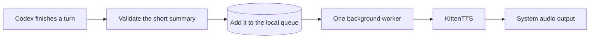

<div align="center">
  <table>
    <tr>
      <td align="center" bgcolor="#202124">
        
      </td>
    </tr>
  </table>
</div>

<h1 align="center">TurnEcho</h1>

<p align="center">
  <strong>Hear the result of every Codex turn.</strong><br>
  A local Codex plugin that speaks a short, useful summary while keeping the
  full response on screen.
</p>

<p align="center">
  <a href="#license"></a>
  <a href="#requirements"></a>
  <a href="#requirements"></a>
  <a href="#installation"></a>
</p>

## Table of contents

- [Introduction](#introduction)
- [Requirements](#requirements)
- [Installation](#installation)
  - [Install from GitHub](#install-from-github)
  - [Install a local checkout](#install-a-local-checkout)
  - [Manage the installation](#manage-the-installation)
  - [Uninstall](#uninstall)
- [Configuration](#configuration)
- [Local data and privacy](#local-data-and-privacy)
- [Troubleshooting](#troubleshooting)
- [Development](#development)
- [License](#license)

## Introduction

TurnEcho adds a small audio layer to Codex. At the end of a turn, it speaks a
short summary of the outcome, blocker, or next action. The complete response
stays on screen, so you can hear what matters now and read the details when you
are ready.

TurnEcho is useful when an agent is working in the background, when you are
reviewing another window, or when you briefly step away from the screen.

### What to expect

- **Short summaries, not full responses.** TurnEcho speaks only a validated
  summary of 1 to 3 conversational sentences.
- **Local processing.** Summary validation, queueing, text-to-speech, and audio
  playback happen on your machine after the model files are available.
- **Unchanged Codex responses.** The written response is never replaced,
  shortened, or read aloud in full.
- **Ordered playback.** Multiple Codex sessions share one queue and one worker,
  so summaries play one at a time.
- **Simple configuration.** A local command controls the model, voice, speech
  speed, and enabled state.

TurnEcho currently supports Codex on macOS and Linux. It has no graphical
configuration interface. A turn produces audio only when Codex includes a
valid TurnEcho summary marker at the end of its final message. Missing or
invalid markers are ignored without changing the response.

### How it works



TurnEcho uses two fast Codex hooks. The first asks Codex to include a hidden
summary marker in its final response. The second validates that marker, stores
a deduplicated job in SQLite, and starts a detached worker. The hooks do not
load the speech model or wait for audio.

The worker claims queued jobs atomically and plays them in order. A
cross-process `fcntl` lock prevents workers from speaking over each other.
Interrupted jobs are recovered when a new worker takes the lock. KittenTTS is
loaded only when work is waiting, stays loaded while the worker is active, and
reloads when the configured model changes.

## Requirements

- macOS or Linux
- Python 3.13 or newer
- [Codex CLI](https://developers.openai.com/codex/cli)
- [uv](https://docs.astral.sh/uv/), available on `PATH` during installation
  and whenever Codex runs the hooks
- a working system audio output device
- network access during installation and the first use of each selected model

## Installation

Choose one installation method:

- For normal use, install the released plugin from GitHub. A local checkout is
  not required.
- For development, install from a local clone so code changes can be tested.

Do not use both methods for the same installation.

### Install from GitHub

Run the TurnEcho installer directly from GitHub:

```sh
uvx --from git+https://github.com/rmscoal/turnecho.git@v0.2.2 turnecho-install
```

This is the recommended installation path because audio dependencies are part
of the product. It checks the model and audio output before installing the
plugin and the `turnecho` command.

The installer keeps Codex-managed plugin source separate from the generated
Python environment. The versioned runtime is stored under
`~/.local/share/turnecho/runtimes/`. Codex can refresh its plugin cache without
deleting TurnEcho's dependencies or command target.

Do not replace this command with `codex plugin add`. Codex installs the plugin
source into its cache, but it does not run TurnEcho's dependency preparation or
create the `turnecho` command. Direct Codex installation is only an internal
step used by the TurnEcho installer.

After installation, start a new Codex thread. If the installer reports that
`~/.local/bin` is not on `PATH`, add it before running `turnecho`.

### Install a local checkout

For development from a clone, run this command from the repository root:

```sh
uv run --no-dev python scripts/install_local_plugin.py
```

Use `--dry-run` to preview the installation or `--skip-codex` to prepare it
without adding the plugin to Codex.

### Manage the installation

#### Update a GitHub installation

To refresh the installed release:

```sh
uvx --refresh --from git+https://github.com/rmscoal/turnecho.git@v0.2.2 turnecho-install --update
```

The update installer replaces the pinned marketplace release, reinstalls the
plugin, prepares the new stable runtime, and updates the managed command link.
If an update fails, it attempts to restore and verify the previous plugin
runtime before returning the original error. If rollback also fails, the
installer reports both failures.

Existing Codex tasks can remain bound to the previous plugin snapshot until a
new task starts. Versioned runtimes are kept so those tasks can finish while
their old plugin source still exists. If Codex has already removed that source,
the hook returns empty JSON and does not run another Python project.

Do not update TurnEcho by running `codex plugin remove` followed by
`codex plugin add`. That recreates the Codex plugin source without preparing
TurnEcho's runtime or command.

#### Repair a GitHub installation

If the current plugin version is still installed but its runtime or
`turnecho` command is missing, rerun the normal installer without `--update`:

```sh
uvx --refresh --from git+https://github.com/rmscoal/turnecho.git@v0.2.2 turnecho-install
```

This atomically prepares the existing release runtime again and repairs its
managed command link without replacing the marketplace release.

#### Update a local checkout

After changing an installed local checkout, run:

```sh
uv run --no-dev python scripts/install_local_plugin.py --update
```

### Uninstall

Remove a GitHub installation with the TurnEcho uninstaller:

```sh
uvx --from git+https://github.com/rmscoal/turnecho.git@v0.2.2 turnecho-install --uninstall
```

This removes the GitHub plugin, its marketplace entry, all marked versioned
runtimes, and the managed `turnecho` command link. It leaves configuration,
queue history, logs, unrelated commands, unrelated symlinks, and unmarked
directories unchanged.

Raw `codex plugin remove turnecho@turnecho` removes Codex's plugin source only.
Codex does not run TurnEcho cleanup code, so it cannot remove the external
runtime or managed command. Run the official uninstaller afterward if the raw
Codex command was already used.

Remove a local-checkout installation with:

```sh
codex plugin remove turnecho@personal
```

The local-checkout installer creates a command link into the checkout. Remove
it after uninstalling the local plugin:

```sh
rm ~/.local/bin/turnecho
```

Only run this command when that path is still the TurnEcho-managed symlink.

Removing the plugin does not delete TurnEcho's local user data. The
configuration, queue, worker log, and stored summaries remain under
`~/.config/turnecho/`. To remove this data too, first back up anything you need,
then run:

```sh
rm -rf ~/.config/turnecho
```

This permanently removes the local queue, logs, and stored summaries.

## Configuration

Configure TurnEcho from your terminal:

```sh
turnecho config show
turnecho config set model micro
turnecho config set voice Luna
turnecho config set speed 1.1
turnecho disable
turnecho enable
turnecho models
turnecho voices
turnecho doctor
turnecho test
```

Run `turnecho models` or `turnecho voices` to see the available options.
Speech speed can be set from `0.5` to `2.0`. Use `turnecho doctor` to check the
model and audio output, or `turnecho test` to play a test phrase.

Add `--json` to `config show`, `models`, `voices`, or `doctor` for
machine-readable output. You can also ask Codex to configure TurnEcho through
the included `turnecho-config` skill.

## Local data and privacy

TurnEcho creates these files in `~/.config/turnecho/`:

- `config.json`: validated model, voice, speed, and enabled settings
- `config.lock`: serializes concurrent configuration updates
- `turnecho.db`: SQLite queue and job history, including stored summaries
- `worker.lock`: process lock used to keep one audio worker active
- `worker.log`: worker output and playback errors

GitHub installations also create versioned Python environments under the user
data location described in the installation section. These environments
contain dependencies and installed TurnEcho code, but not summaries or user
configuration.

Summary text stays in the SQLite database after playback. Do not use TurnEcho
for sensitive responses unless storing that text locally is acceptable. Model
inference and audio playback run locally after the model files are available.
Network access is needed during installation and the first use of a model for
dependencies and model files.

## Troubleshooting

### No audio plays

Check `~/.config/turnecho/worker.log` first. Common causes are an unavailable
audio output device, model download failure, or missing system audio support.

Check configuration and the local runtime:

```sh
turnecho config show
turnecho doctor
turnecho test
```

The worker only loads the TTS model when at least one pending job exists. It
loads a replacement before the next inference after the configured model
changes.

### A manual test does not play again

Each `(host, session_id, turn_id)` tuple is unique. Change `turn_id` before
repeating a manual hook test.

### Playback starts slowly

The first queued response for a selected model may take longer because the TTS
model must be downloaded and loaded. A running worker keeps the model in memory
while it waits for more jobs.

## Development

Install dependencies:

```sh
uv sync --no-dev
```

### Test the hook manually

If your Codex version does not offer local plugin installation, you can test
the hook from the repository with:

```sh
printf '%s' '{
  "hook_event_name": "Stop",
  "session_id": "manual-session",
  "turn_id": "manual-turn-1",
  "last_assistant_message": "TurnEcho is ready.\n\n<!-- turnecho-summary:v1\nTurnEcho is ready and speaking is configured.\n-->\n",
  "stop_hook_active": false
}' | PLUGIN_ROOT="$PWD" PYTHONPATH="$PWD/src" .venv/bin/python -m turnecho.stop_hook
```

The command prints `{}` immediately. Audio is played by the detached worker,
so it may begin shortly after the command finishes. Use a new `turn_id` for
each manual test because TurnEcho deduplicates turns.

### Run the checks

Run lint and formatting checks:

```sh
make check
```

Run tests:

```sh
uv run --no-dev python -m unittest discover -s tests
```

Source code lives in `src/turnecho/`. Tests use Python's standard `unittest`
framework and mock TTS and audio output, so the normal test suite does not
play sound or load the model.

## License

TurnEcho is released under the [MIT License](LICENSE).
